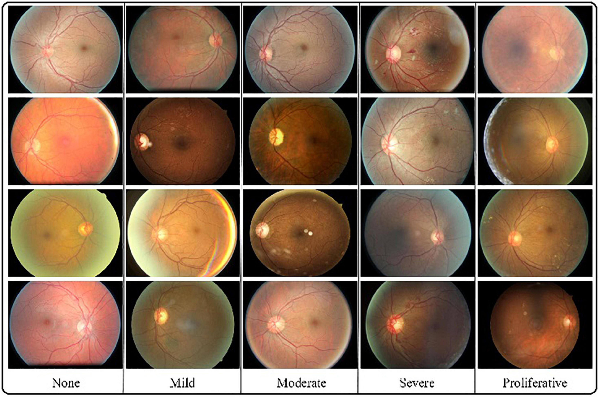

# Diabetic Retinopathy Classification

## Introduction

Diabetic retinopathy is a leading cause of blindness among adults. Early detection through retinal imaging can prevent vision loss. This project leverages deep learning techniques to classify retinal images into different stages of diabetic retinopathy, enabling early diagnosis and treatment.

## Dataset

The dataset used for training and testing the models consists of retinal images labeled with different stages of diabetic retinopathy. This dataset can be obtained from the [Kaggle Diabetic Retinopathy Detection competition](https://www.kaggle.com/c/diabetic-retinopathy-detection) or any other similar source.



- **Classes**: 
  - 0: No Diabetic Retinopathy
  - 1: Mild Diabetic Retinopathy
  - 2: Moderate Diabetic Retinopathy
  - 3: Severe Diabetic Retinopathy
  - 4: Proliferative Diabetic Retinopathy

## Model Architecture

The model architecture used for this project is based on CNN with EffecientNet-B3.

## Installation

### Prerequisites

- Python 3.7+
- PyTorch
- NumPy
- OpenCV
- Streamlit

### Setup

Clone the repository and install the necessary dependencies:

```bash
git clone https://github.com/saidislombek-abdusamatov/diabetic_retinopathy_classification.git
cd diabetic_retinopathy_classification
pip install -r requirements.txt
```

## Usage

### Running Inference

To classify new images, use the `streamlit run` script:

```bash
streamlit run app.py
```
